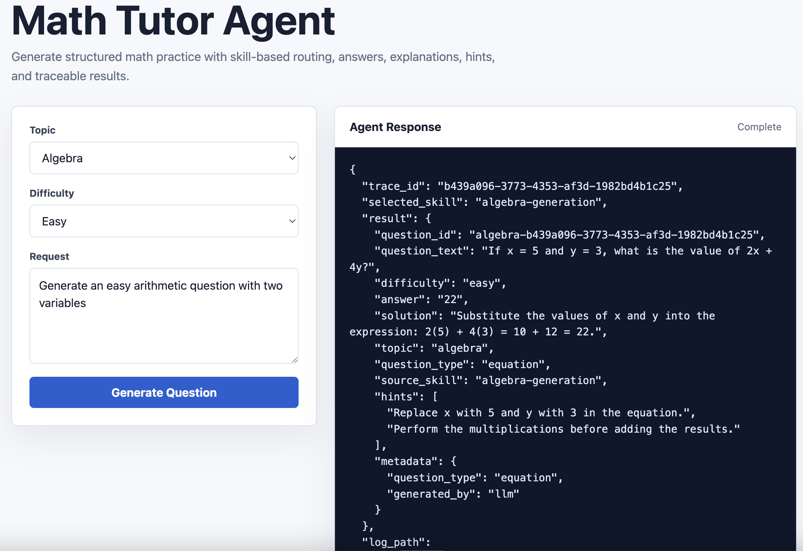

# Math Tutor Agent

A skill-based, agentic math tutoring system that generates age-appropriate math questions using LLMs. The system routes requests to specialized skills, persists questions to SQLite, traces all LLM interactions, and provides a web UI for interaction.

### Preview


**Key Features:**
- 🎯 **Skill-based routing**: Request router intelligently selects the right skill for each request
- 🧠 **LLM-powered generation**: Uses OpenAI, Gemini, or local models (Ollama) to generate questions
- 🛡️ **Request guardrails**: Validates incoming requests before any LLM call by enforcing supported topics, difficulty levels, prompt length limits, and detecting common prompt injection attempts.
- 📊 **SQLite persistence**: Store question history and detect duplicates across sessions
- 📝 **Full tracing**: Every LLM prompt/response logged to JSONL for debugging and analysis
- 🧪 **Comprehensive testing**: 3 test cases per skill with 100% pass rate
- 🎨 **Web UI**: FastAPI + HTML5 interface for easy interaction

---

## 📁 Project Structure

```
math-tutor-agent/
├── README.md                          # This file
├── USAGE.md                           # Quick reference guide
├── requirements.txt                   # Python dependencies
├── .env                               # Environment configuration (OPENAI_API_KEY, etc.)
├── .gitignore                         # Git ignore rules
│
├── orchestrator.py                    # Main entry point - routes requests to skills
├── query_store.py                     # CLI tool to query the question database
│
├── skills/                            # All skill implementations
│   ├── __init__.py                   # Skills package marker
│   ├── common.py                     # Shared utilities (SkillLogger)
│   ├── database.py                   # SQLite QuestionStore class
│   │
│   ├── llm/                          # LLM client (OpenAI, Gemini)
│   │   ├── __init__.py
│   │   └── client.py                 # LLMClient - unified LLM interface
│   │
│   ├── arithmetic_generation/        # Skill: Generate arithmetic questions
│   │   ├── __init__.py
│   │   ├── skill.md                  # Skill description for LLM router
│   │   ├── skill.py                  # Implementation: run_skill()
│   │   └── test_skill.py             # 3 test cases
│   │
│   ├── algebra_generation/           # Skill: Generate algebra questions
│   │   ├── __init__.py
│   │   ├── skill.md
│   │   ├── skill.py
│   │   └── test_skill.py
│   │
│   ├── fraction_generation/          # Skill: Generate fraction questions
│   │   ├── __init__.py
│   │   ├── skill.md
│   │   ├── skill.py
│   │   └── test_skill.py
│   │
│   ├── geometry_generation/          # Skill: Generate geometry questions
│   │   ├── __init__.py
│   │   ├── skill.md
│   │   ├── skill.py
│   │   └── test_skill.py
│   │
│   ├── word_problem_generation/      # Skill: Generate word problems
│   │   ├── __init__.py
│   │   ├── skill.md
│   │   ├── skill.py
│   │   └── test_skill.py
│   │
│   ├── difficulty_classifier/        # Skill: Verify question difficulty
│   │   ├── __init__.py
│   │   ├── skill.md
│   │   ├── skill.py
│   │   └── test_skill.py
│   │
│   ├── question_validator/           # Skill: Check question solvability
│   │   ├── __init__.py
│   │   ├── skill.md
│   │   ├── skill.py
│   │   └── test_skill.py
│   │
│   └── duplicate_detector/           # Skill: Find duplicate questions
│       ├── __init__.py
│       ├── skill.md
│       ├── skill.py
│       └── test_skill.py
│
├── ui/                                # Web UI
│   ├── __init__.py
│   ├── app.py                        # FastAPI application
│   └── templates/
│       └── index.html                # Web interface
│
├── docs/                              # Documentation
│   └── PROJECT_SPECIFICATION.md      # Original requirements
│   └── KAGGLE_WRITEUP_DRAFT.md       # Draft writeup for Kaggle submission
│   └── SUBMISSION_NOTES.md           # Capstone submission summary
│   └── VIDEO_SCRIPT.md               # Demo video outline
│
├── data/                              # Created at runtime
│   └── questions.db                  # SQLite question store
│
├── logs/                              # Created at runtime
│   └── trace.jsonl                   # JSONL trace log
│
└── .venv/                             # Python virtual environment
```

---

## 🚀 Quick Start

### Setup

```bash
# Clone and navigate to the project
cd /path/to/MathTutorAgent

# Create virtual environment (if not already done)
python3 -m venv .venv
source .venv/bin/activate

# Install dependencies
pip install -r requirements.txt

# Configure API keys
export OPENAI_API_KEY="your-key-here"
export LLM_PROVIDER="openai"  # or "gemini"
```

### Run the Orchestrator (CLI)

```bash
# Generate an easy arithmetic question
python orchestrator.py --request "Generate an easy arithmetic question"

# Generate specific math topics
python orchestrator.py --request "Generate a hard algebra question"
python orchestrator.py --request "Generate a geometry problem about area"
python orchestrator.py --request "Generate a word problem for shopping"

# Provide JSON payload
python orchestrator.py --json '{"topic":"fractions","difficulty":"medium"}'
```

### Query the Database

```bash
# Show statistics
python query_store.py --stats

# Show recent questions
python query_store.py --recent 10

# Filter by topic
python query_store.py --recent 5 --topic arithmetic

# Find duplicate/similar questions
python query_store.py --find-duplicates "What is 2 + 3?"
```

### Run the Web UI

```bash
# Start the FastAPI server
uvicorn ui.app:app --reload

# Visit http://localhost:8000 in your browser
```

### Run Tests

```bash
# Run all tests (24 total)
pytest -q

# Run specific skill tests
pytest skills/arithmetic_generation/test_skill.py -v

# Run with coverage
pytest --cov=skills
```

---

## 📋 File Reference

### Root Level

| File | Purpose |
|------|---------|
| `orchestrator.py` | **Main orchestrator**: Routes user requests to the appropriate skill. Logs all decisions and results to trace.jsonl. Automatically saves generated questions to the database. |
| `query_store.py` | **Database query CLI**: Command-line tool to inspect the question store. Show stats, list recent questions, find duplicates. |
| `requirements.txt` | Python package dependencies (fastapi, openai, google-genai, pydantic, etc.). |
| `.env` | Environment configuration. Add `OPENAI_API_KEY`, `LLM_PROVIDER`, etc. |
| `.gitignore` | Git ignore rules. Excludes `.venv`, `logs/`, `data/`, and `.db` files. |
| `README.md` | This file. |
| `USAGE.md` | Quick reference guide with examples. |

### skills/ - Core Skill System

| File/Folder | Purpose |
|-------------|---------|
| `skills/__init__.py` | Package marker. |
| `skills/common.py` | **SkillLogger**: Logs all events (LLM requests, responses, orchestrator decisions) to JSONL. Provides structured trace for debugging. |
| `skills/database.py` | **QuestionStore**: SQLite wrapper for storing and querying questions. Methods: `save()`, `find_similar()`, `find_all()`, `count()`. |
| `skills/llm/` | LLM abstraction layer. |
| `skills/llm/client.py` | **LLMClient**: Unified interface to OpenAI, Gemini, and Ollama. Handles prompt sending, response parsing, fallback to stub for testing. |

### Generation Skills (Each follows same pattern)

Each generation skill folder contains:

| File | Purpose |
|------|---------|
| `skill.md` | **Skill description** (sent to router LLM). Explains what the skill does, expected input/output, use cases. Keep concise. |
| `skill.py` | **Implementation**: `run_skill(request, logger, trace_id)` function. Takes a request dict, calls LLM, returns structured question payload. |
| `test_skill.py` | **Unit tests**: 3 test cases per skill validating the output structure and business logic. |
| `__init__.py` | Package marker. |

#### Generation Skills Available

1. **arithmetic_generation/** - Addition, subtraction, multiplication, division
2. **algebra_generation/** - Equations and inequalities with variables
3. **fraction_generation/** - Simplification, comparison, operations
4. **geometry_generation/** - Area, perimeter, volume calculations
5. **word_problem_generation/** - Real-world contextual math problems

### Utility Skills (Each follows same pattern)

1. **difficulty_classifier/** - Verify that a question matches the requested difficulty level
2. **question_validator/** - Check if a question is solvable, unambiguous, has clear answer path
3. **duplicate_detector/** - Find similar questions in the database to avoid repeats

### ui/ - Web Interface

| File | Purpose |
|------|---------|
| `ui/app.py` | **FastAPI application**. Defines routes: `GET /` (serve HTML), `POST /api/generate` (handle requests). Calls orchestrator and returns results. |
| `ui/templates/index.html` | **Web form and JavaScript**. Client-side UI with form inputs (topic, difficulty, prompt), sends requests to `/api/generate`, displays JSON response. |

### docs/ - Documentation

| File | Purpose |
|------|---------|
| `docs/PROJECT_SPECIFICATION.md` | Original project requirements. Describes the system design, goals, skill architecture, and evaluation criteria. |

### data/ - Runtime Database (Created Automatically)

| File | Purpose |
|------|---------|
| `data/questions.db` | **SQLite database**. Stores all generated questions with metadata (question_id, topic, difficulty, answer, source_skill, trace_id, created_at). Indexed for fast lookup. |

### logs/ - Runtime Logs (Created Automatically)

| File | Purpose |
|------|---------|
| `logs/trace.jsonl` | **JSONL trace log**. One JSON entry per line. Records: LLM requests, LLM responses, orchestrator routing decisions, skill execution results, database saves. Timestamp and trace_id on every entry for correlation. |

---

## 🔄 Request Flow

```
┌──────────────────┐
│   User Request   │ "Generate an easy algebra question"
└────────┬─────────┘
         │
         ▼
┌──────────────────────────────┐
│   orchestrator.py            │
│  1. Create trace_id          │
│  2. Log request              │
│  3. Call select_skill()      │ ← Uses LLM to route
└────────┬─────────────────────┘
         │
         ▼
┌──────────────────────────────┐
│   Skill Router (LLM)         │
│  Reads skill descriptions    │ Reads *.md files
│  Returns: "algebra-gen"      │
└────────┬─────────────────────┘
         │
         ▼
┌──────────────────────────────┐
│   algebra_generation.py      │
│  1. Call LLM for question    │
│  2. Parse response           │
│  3. Return structured JSON   │
└────────┬─────────────────────┘
         │
         ▼
┌──────────────────────────────┐
│   orchestrator.py (cont)     │
│  1. Log result               │
│  2. Save to database         │ ← data/questions.db
│  3. Return response          │
└────────┬─────────────────────┘
         │
         ▼
┌──────────────────────────────┐
│   Logs                       │
│  - llm_request              │
│  - llm_response             │
│  - orchestrator_selection   │
│  - orchestrator_result      │
│  - database_save            │
└──────────────────────────────┘
```

---

## 📊 Data Model

### Question Object (JSON)

Every generated question has this structure:

```json
{
  "question_id": "arithmetic-uuid",
  "question_text": "What is 5 + 3?",
  "difficulty": "easy",
  "answer": "8",
  "solution": "Add 5 and 3 to get 8.",
  "topic": "arithmetic",
  "question_type": "addition",
  "source_skill": "arithmetic-generation",
  "hints": ["Start with the first number."],
  "metadata": {
    "operation": "addition",
    "generated_by": "llm"
  }
}
```

### Database Schema

```sql
CREATE TABLE questions (
    id INTEGER PRIMARY KEY AUTOINCREMENT,
    question_id TEXT UNIQUE,
    topic TEXT,
    difficulty TEXT,
    question_text TEXT,
    answer TEXT,
    solution TEXT,
    source_skill TEXT,
    trace_id TEXT,
    created_at TEXT
);

CREATE INDEX idx_topic_difficulty ON questions(topic, difficulty);
CREATE INDEX idx_question_text ON questions(question_text);
```

### Trace Log Format (JSONL)

Each line is a JSON object:

```json
{
  "timestamp": "2026-07-04T10:30:45.123456+00:00",
  "event_type": "llm_request",
  "trace_id": "uuid",
  "prompt": "Generate...",
  "max_tokens": 256
}

{
  "timestamp": "2026-07-04T10:30:46.234567+00:00",
  "event_type": "llm_response",
  "trace_id": "uuid",
  "response": "Question: ..."
}

{
  "timestamp": "2026-07-04T10:30:46.345678+00:00",
  "event_type": "orchestrator_selection",
  "trace_id": "uuid",
  "selected_skill": "arithmetic-generation"
}

{
  "timestamp": "2026-07-04T10:30:46.456789+00:00",
  "event_type": "database_save",
  "trace_id": "uuid",
  "question_id": "arithmetic-uuid",
  "saved": true
}
```

---

## 🧪 Testing

### Test Coverage

- **24 total tests**: 3 per skill × 8 skills
- **100% pass rate**: All tests validate output structure and business logic
- **Test patterns**: 
  - Positive case: Happy path
  - Medium case: Specific parameter handling
  - Validation case: Output structure verification

### Running Tests

```bash
# All tests
pytest -q

# Specific skill
pytest skills/arithmetic_generation/test_skill.py -v

# With coverage
pytest --cov=skills --cov-report=html

# Specific test
pytest skills/arithmetic_generation/test_skill.py::test_arithmetic_skill_returns_question_payload -v
```

---

## 🔧 Configuration

### Environment Variables (.env)

```bash
# LLM Provider: "openai", "gemini", or local service
LLM_PROVIDER=openai

# OpenAI Configuration
OPENAI_API_KEY=sk-...
OPENAI_MODEL=gpt-3.5-turbo

# Gemini Configuration
GEMINI_API_KEY=...
GEMINI_MODEL=models/text-bison-001

# Optional: Ollama Configuration
# OLLAMA_HOST=http://localhost:11434
```

### Database Location

Default: `data/questions.db`

Change in code:
```python
from skills.database import QuestionStore
store = QuestionStore("/path/to/custom.db")
```

### Logs Location

Default: `logs/trace.jsonl`

Change in code:
```python
from skills.common import SkillLogger
logger = SkillLogger("/path/to/custom.jsonl")
```

---

## 🎯 How to Extend

### Add a New Skill

1. Create directory: `skills/new_skill/`
2. Add `skill.md` with brief description
3. Add `skill.py` with `run_skill(request, logger, trace_id)` function
4. Add `test_skill.py` with 3 test cases
5. Register in `orchestrator.py` SKILLS dict
6. Update skill descriptions in router

### Add a New Question Topic

1. Create generation skill folder (see above)
2. Implement LLM-based generation in `skill.py`
3. Test with `pytest`
4. Update UI/documentation

### Switch LLM Provider

Update `.env`:
```bash
LLM_PROVIDER=gemini  # or "openai", or local Ollama
GEMINI_API_KEY=...
```

Restart the app. `LLMClient` automatically uses the configured provider.

---

## 🐛 Debugging

### View LLM Prompts and Responses

```bash
# Live tail of trace log
tail -f logs/trace.jsonl

# Filter by event type
grep "llm_request" logs/trace.jsonl | head -5
grep "llm_response" logs/trace.jsonl | head -5
```

### Find All Events for a Trace ID

```bash
TRACE_ID="abc123..."
grep "$TRACE_ID" logs/trace.jsonl
```

### Inspect Database

```bash
# Using sqlite3 CLI
sqlite3 data/questions.db

# From Python
from skills.database import QuestionStore
store = QuestionStore()
store.find_all(topic="arithmetic", limit=10)
```

### Test a Single Skill Directly

```python
from skills.arithmetic_generation.skill import run_skill

result = run_skill({"topic": "arithmetic", "difficulty": "easy"})
print(result)
```

---

## 📦 Dependencies

See `requirements.txt`:

- **fastapi** - Web framework
- **uvicorn** - ASGI server
- **openai** - OpenAI API client
- **google-genai** - Gemini API client (deprecated, for backwards compat)
- **pydantic** - Data validation
- **python-dotenv** - Load .env files
- **pytest** - Testing framework
- **ollama** - Ollama client (optional)

---

## 🔐 Security Notes

- **API Keys**: Store in `.env`, never commit to git
- **Database**: SQLite is single-file, fine for dev/small scale. Use PostgreSQL for production
- **Logs**: JSONL logs are plaintext; avoid logging sensitive data beyond trace IDs
- **UI**: Basic web form; add authentication if needed

## 🛡️ Guardrails

The orchestrator validates every incoming request before invoking the LLM. This prevents invalid requests from consuming model calls and provides basic protection against prompt injection attempts.

### Validation Rules

| Guardrail | Description |
|-----------|-------------|
| Supported Topics | Requests must target one of the supported math topics (Arithmetic, Algebra, Fractions, Geometry, or Word Problems). |
| Difficulty Validation | Difficulty must be `easy`, `medium`, or `hard`. |
| Prompt Length | Prompts are limited to **500 characters**. |
| Prompt Normalization | Leading and trailing whitespace is removed before validation. |
| Prompt Injection Detection | Requests containing suspicious instruction patterns are rejected. |

### Blocked Prompt Patterns

The following phrases are rejected before any LLM call:

- `ignore previous instructions`
- `system prompt`
- `developer message`
- `api key`
- `password`

### Error Handling

Requests that fail validation raise a `GuardrailError`. Validation occurs before skill routing and LLM invocation, reducing unnecessary model calls and helping ensure only well-formed requests are processed.

---

## 📈 Next Steps

- [ ] Add student progress tracking
- [ ] Implement spaced repetition for weak topics
- [ ] Add hint generation with progressive difficulty
- [ ] Integrate with learning outcome metrics
- [ ] Support PDF export of question sets
- [ ] Multi-language support
- [ ] PostgreSQL integration for production scale

---

## 🤝 Contributing

1. Create a new skill or extend an existing one
2. Add 3 test cases covering positive/negative/edge cases
3. Update `orchestrator.py` SKILLS registry
4. Run `pytest -q` to validate
5. Update documentation

---

## 📜 License

This project is part of the Adaptive Math Tutor initiative.

---

## 🆘 Troubleshooting

| Problem | Solution |
|---------|----------|
| `ModuleNotFoundError` | Ensure you've run `pip install -r requirements.txt` in `.venv` |
| API key errors | Check `.env` file has correct `OPENAI_API_KEY` and `LLM_PROVIDER` |
| Database not found | Run orchestrator once to auto-create `data/questions.db` |
| Port 8000 in use | Change UI port: `uvicorn ui.app:app --port 8001` |
| Tests fail | Clear `.pytest_cache/` and re-run `pytest -q` |
| Empty responses | Check LLM client fallback in `skills/llm/client.py` or set up API keys |

---

**Happy tutoring! 🎓**
